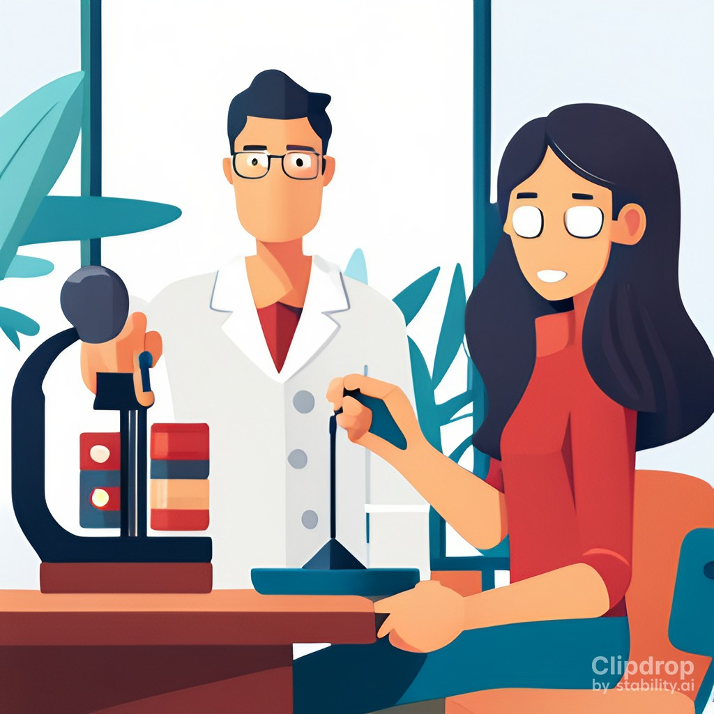
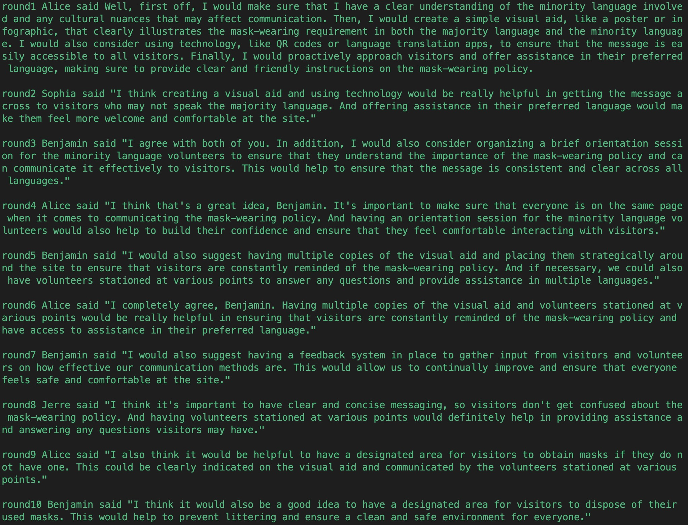

# 🥳 AISimuToolKit: Use language models to simulate experiments

<p align="center">
    <a href="https://pypi.org/project/AISimuToolKit/">
        
    </a>
</p>

<div align="center">
    
</div>

## 🔨 Quick Install

``` shell
conda create -n AISimu python==3.10
pip install AISimuToolKit
python demo_leaderless_discuss.py
python demo_meeting.py
```

## 🥸 Functions
1. Use LLM to simulate agents with different profiles
    - openai gpt-3.5-turbo
    - llaMA-7B (Need to deploy yourself)
        1. download `llaMA-7B` weight and put it in `model/llama-7b` directory
        2. download `alpaca-lora-7b` weight and put it in `model/alpaca-lora-7b` directory
        3. deploy
        ``` shell
        docker run -it --name test -v model:/usr/src/app/model -v data:/usr/src/app/data -v result:/usr/src/app/result --gpus all  llama_service:v1
        export PYTHONPATH=/usr/src/app/
        cd src/deploy/
        python deploy.py
        ```
2. Serial and parallel experiment, see [demo](#-demo)
3. Memory compression => summary, reflect and finetune
    - **<u>summary</u>**
    - **<u>reflect</u>** 
    - **<u>finetune</u>**  We use a language model to convert recent experiences into conversational corpus for finetune.
    The function is currently available, but what parameters can be set to make the model remember these experiences needs to be further tested.(Feel free to contact us if you have any 💡ideas)
4. A kit for simulation experiments


## 👀 Demo
1. **Serial example**    [demo_leaderless_discuss.py](demo_leaderless_discuss.py)  
**<u>Background</u>** Four people, Alice, Sophia, Jerre and Benjamin with different profiles are interviewing to be volunteers for the Olympics. This is a leaderless panel. The topic of discussion was "Minority language volunteers take half an hour to get to the site. As the only volunteer on site, now how will you inform foreigners of minority language that they must wear masks before entering the site"  
**<u>Result</u>**
<div align="center">
    
</div>
<div align="center">
    
</div>


2. **Parallel example** [demo_meeting.py](demo_meeting.py)  
**<u>Background</u>**  Alice needs hold a project progress docking meeting this afternoon.She is so busy she don't have time to schedule meetings herself. Alice needs her secretary, Bob, to arrange a meeting for the rest of the project, including Carol and Dave, in the conference room at 3:00 this afternoon.  
**<u>Result</u>** Bob can send the meeting notification, but the subsequent freedom is too high. More restrictions and testing are needed...


## 📝 TODO list
- Decoupling prompt
- Add environment
    - Social 
    - Physical
- Fine-grained time scheduling
- Better serial and parallel logic including Automatic identification group
- Explore the finetune parameter to make the model remember these experiences 
- Support more LLMs


## 👋 Contributing 
Thank you for your attention and support to this project. If you find a problem or have suggestions for improvement, please feel free to create an Issue in this warehouse, we will deal with it in time.

If you are interested in contributing to the project, feel free to Fork this repository and submit your code. We welcome all contributors !

## 🙇 References & Thanks
1. LOGO https://clipdrop.co/stable-diffusion
2. Reflect https://arxiv.org/abs/2304.03442
3. LLaMA-7B https://github.com/facebookresearch/llama
4. alpaca-lora https://github.com/tloen/alpaca-lora

